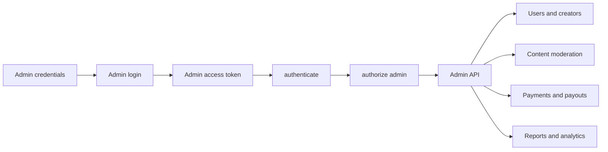
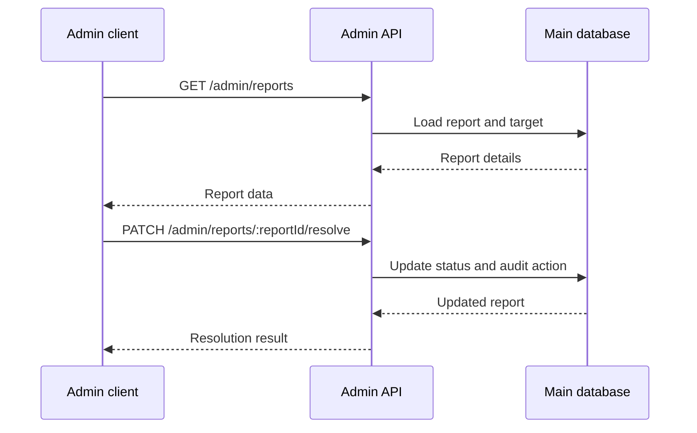

# Zemin Admin Guide

## Access model

Admin authentication is separate from normal user login flows:

1. Configure `ADMIN_SECRET_KEY` in `backend/.env`.
2. Register with `POST /api/v1/auth/admin/register`.
3. Verify the OTP with `POST /api/v1/auth/admin/verify-otp`.
4. Sign in with `POST /api/v1/auth/admin/login`.
5. Use the returned access token on every `/api/v1/admin/*` request.

Every admin route applies `authenticate` and `authorize('admin')`. A valid token without the admin role receives `403 FORBIDDEN`.



## Main workflows

| Area | Endpoints | Typical action |
|---|---|---|
| Users | `/admin/users` | Search, inspect, ban, unban, and change roles |
| Creators | `/admin/creators` | Review, approve, reject, or suspend applications |
| Content | `/admin/content/posts`, `/admin/content/comments` | Hide, restore, or delete content |
| Reports | `/admin/reports` | Inspect, resolve, or dismiss reports |
| Finance | `/admin/payments`, `/admin/payouts` | Inspect payments and approve or reject payouts |
| Live | `/admin/live` | Inspect, warn, or stop live streams |
| Messaging | `/admin/chats`, `/admin/notifications` | Review conversations and manage notifications |
| Analytics | `/admin/stats/*`, `/admin/activity` | Review platform and moderation activity |

Use the full runtime prefix. For example:

```http
GET http://localhost:3000/api/v1/admin/reports
Authorization: Bearer <admin-access-token>
```

## Notification operations

`POST /admin/notifications/send` targets one user. `POST /admin/notifications/broadcast` targets all active users with `all: true` or a supplied `userIds` array. Use a stable `dedupeKey` for retried broadcasts. Set `sendPush` according to the required delivery behavior.

## Moderation discipline

Inspect the target before destructive actions. Prefer hide/restore for reversible content decisions. Resolve or dismiss reports after recording the decision. Payment methods and payout records contain sensitive financial information and must only be exposed to authorized administrators.



## Test data

From `backend/`:

```powershell
npm run seed:reports
npm run seed:payments
npm run seed:chats
npm run seed:notifications
```

The admin Postman collection is available at [../backend/Zemin-Admin-API.postman_collection.json](../backend/Zemin-Admin-API.postman_collection.json).
