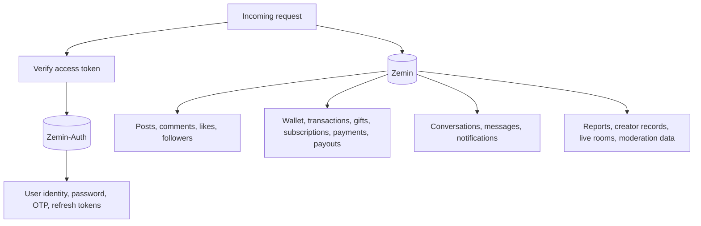
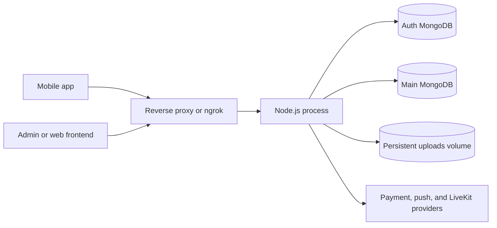

# Zemin Backend Architecture

## System Diagram

```mermaid
flowchart LR
  Client[Web or React Native client] -->|HTTP JSON / multipart| API[Express API]
  Client -->|Socket.IO + access token| WS[Socket.IO server]
  API --> Security[Helmet, CORS, compression, rate limits]
  Security --> Routes[/api/v1 routes]
  Routes --> Auth[Auth controllers]
  Routes --> Domain[Feed, creator, wallet, live, chat, notification, search, subscription, upload, report]
  Routes --> Admin[Admin controllers]
  Auth --> AuthDB[(MongoDB Auth DB)]
  Domain --> MainDB[(MongoDB Main DB)]
  Admin --> MainDB
  Domain --> Files[(Local upload directory)]
  Domain --> Razorpay[Razorpay]
  Domain --> LiveKit[LiveKit WebRTC]
  Domain --> Firebase[Firebase Admin push]
  WS --> Rooms[User, live, and chat rooms]
  Rooms --> Client
```

## Runtime Layers

1. `server.js` connects the authentication and application MongoDB databases, initializes LiveKit when configured, creates the HTTP server, initializes Socket.IO, and listens on `PORT`.
2. `app.js` configures security middleware, JSON and URL-encoded parsing, static uploads, health endpoints, the global API limiter, route mounting, and the error handler.
3. `routes/` defines public, optional-auth, authenticated, creator, and admin boundaries.
4. `middleware/` handles JWT authentication, role checks, validation, rate limiting, and normalized errors.
5. `controllers/` coordinates request handling and domain operations.
6. `models/` persists auth and application data through the two database connections.
7. `services/`, `utils/`, and `sockets/` provide integrations, shared utilities, and real-time behavior.

## Database Boundary



The auth user is loaded from the auth database during `authenticate`; deleted or banned accounts are rejected before a controller runs. Application records use the main database.

## Security Boundaries

- HTTP protected routes require `Authorization: Bearer <access-token>`.
- `optionalAuth` allows public discovery and post reads while enriching requests for logged-in users.
- Creator routes accept the creator role or `isCreator`; admin is accepted where the route explicitly allows it.
- Admin routes install `authenticate` and `authorize('admin')` once at the router level.
- JSON requests are limited to 10 MB; uploads are handled by the upload controller.
- Global rate limiting returns HTTP 429 with `RATE_LIMITED`.
- Validation currently covers the auth request schemas. Other route payloads are checked by their controllers and models.

## Integration Responsibilities

- Razorpay handles payment order creation and payment verification.
- LiveKit provides live media infrastructure when `LIVEKIT_URL`, `LIVEKIT_API_KEY`, and `LIVEKIT_API_SECRET` are configured.
- Firebase Admin can send push notifications when notification push is enabled.
- Socket.IO provides authenticated real-time presence, live chat, viewer counts, and chat typing indicators.

## Deployment Shape



Keep `UPLOAD_DIR` on persistent storage in production. Set explicit `ALLOWED_ORIGINS`, strong JWT secrets, and a strong `ADMIN_SECRET_KEY`; the development defaults in `config/env.js` are not production credentials.
