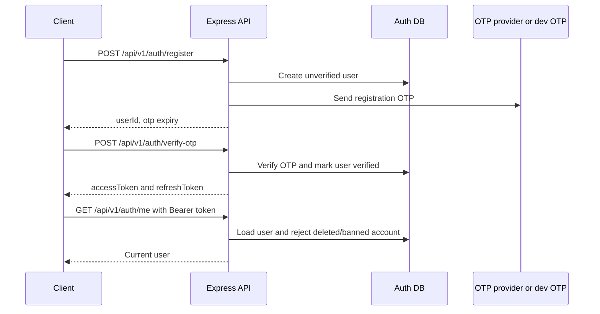
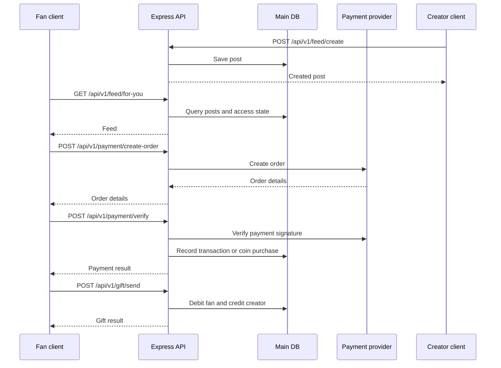
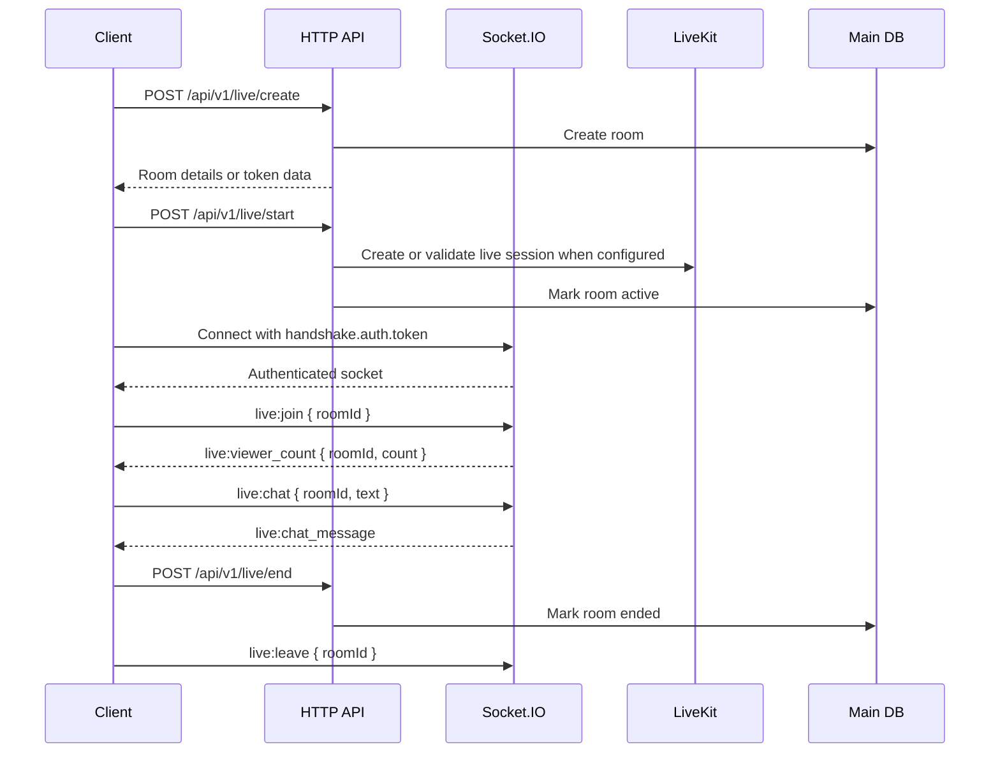
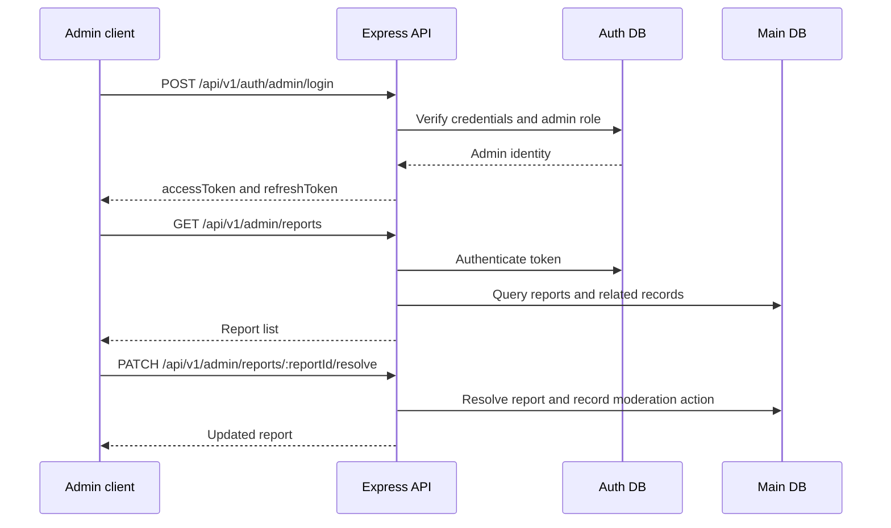
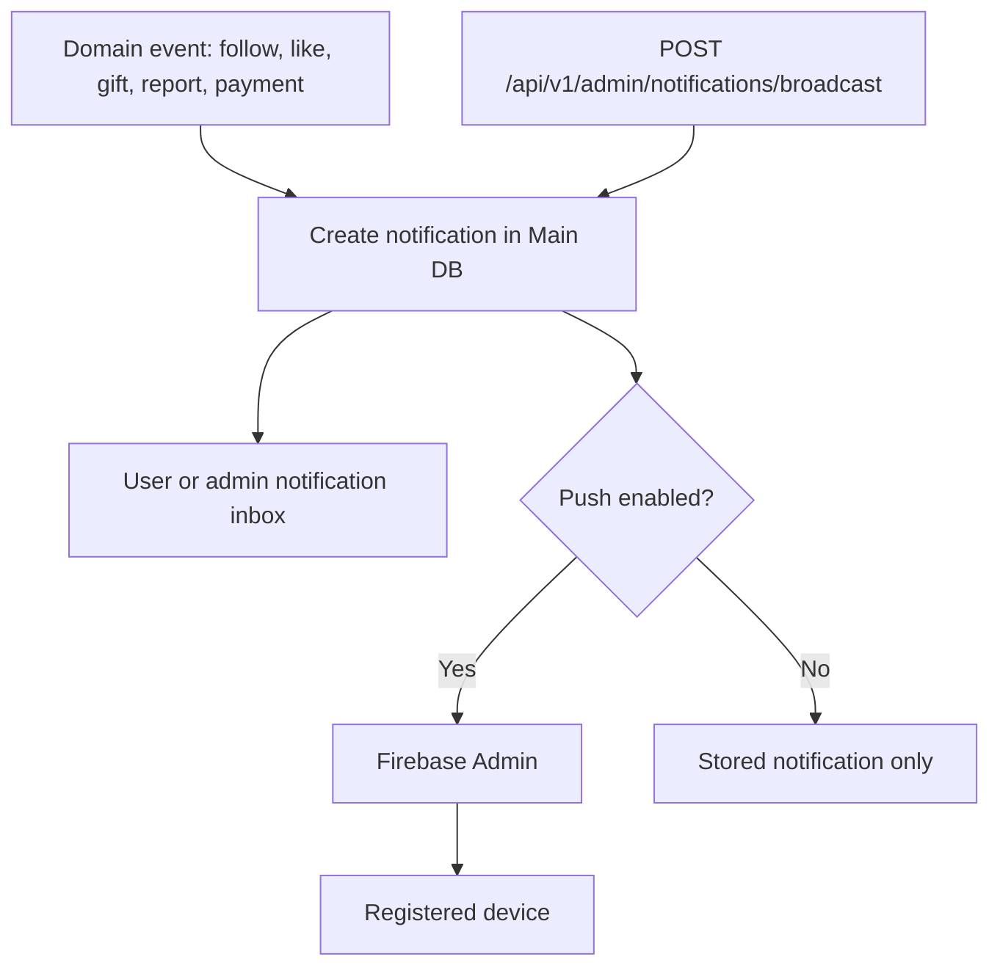
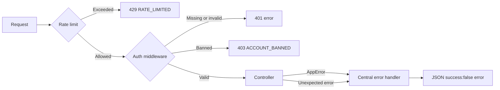

# Zemin Request Flows

## User Registration and Login

```mermaid
sequenceDiagram
  participant C as Client
  participant A as Express API
  participant U as Auth DB
  participant P as OTP provider or dev OTP

  C->>A: POST /api/v1/auth/register
  A->>U: Create unverified user
  A->>P: Send registration OTP
  A-->>C: userId, otp expiry
  C->>A: POST /api/v1/auth/verify-otp
  A->>U: Verify OTP and mark user verified
  A-->>C: accessToken and refreshToken
  C->>A: GET /api/v1/auth/me with Bearer token
  A->>U: Load user and reject deleted/banned account
  A-->>C: Current user
```

## Content and Monetization

```mermaid
sequenceDiagram
  participant F as Fan client
  participant API as Express API
  participant DB as Main DB
  participant Pay as Payment provider
  participant Creator as Creator client

  Creator->>API: POST /api/v1/feed/create
  API->>DB: Save post
  API-->>Creator: Created post
  F->>API: GET /api/v1/feed/for-you
  API->>DB: Query posts and access state
  API-->>F: Feed
  F->>API: POST /api/v1/payment/create-order
  API->>Pay: Create order
  Pay-->>API: Order details
  API-->>F: Order details
  F->>API: POST /api/v1/payment/verify
  API->>Pay: Verify payment signature
  API->>DB: Record transaction or coin purchase
  API-->>F: Payment result
  F->>API: POST /api/v1/gift/send
  API->>DB: Debit fan and credit creator
  API-->>F: Gift result
```

## Live Streaming and Real-Time Chat

```mermaid
sequenceDiagram
  participant C as Client
  participant API as HTTP API
  participant S as Socket.IO
  participant LK as LiveKit
  participant DB as Main DB

  C->>API: POST /api/v1/live/create
  API->>DB: Create room
  API-->>C: Room details or token data
  C->>API: POST /api/v1/live/start
  API->>LK: Create or validate live session when configured
  API->>DB: Mark room active
  C->>S: Connect with handshake.auth.token
  S-->>C: Authenticated socket
  C->>S: live:join { roomId }
  S-->>C: live:viewer_count { roomId, count }
  C->>S: live:chat { roomId, text }
  S-->>C: live:chat_message
  C->>API: POST /api/v1/live/end
  API->>DB: Mark room ended
  C->>S: live:leave { roomId }
```

## Admin Moderation

```mermaid
sequenceDiagram
  participant Admin as Admin client
  participant API as Express API
  participant Auth as Auth DB
  participant DB as Main DB

  Admin->>API: POST /api/v1/auth/admin/login
  API->>Auth: Verify credentials and admin role
  Auth-->>API: Admin identity
  API-->>Admin: accessToken and refreshToken
  Admin->>API: GET /api/v1/admin/reports
  API->>Auth: Authenticate token
  API->>DB: Query reports and related records
  API-->>Admin: Report list
  Admin->>API: PATCH /api/v1/admin/reports/:reportId/resolve
  API->>DB: Resolve report and record moderation action
  API-->>Admin: Updated report
```

## Notification Delivery

```mermaid
flowchart TD
  Event[Domain event: follow, like, gift, report, payment] --> Create[Create notification in Main DB]
  Create --> Inbox[User or admin notification inbox]
  Create --> Push{Push enabled?}
  Push -->|Yes| Firebase[Firebase Admin]
  Push -->|No| Stored[Stored notification only]
  Firebase --> Device[Registered device]
  Admin[POST /api/v1/admin/notifications/broadcast] --> Create
```

## Error Path

```mermaid
flowchart LR
  Request[Request] --> Limit{Rate limit}
  Limit -->|Exceeded| TooMany[429 RATE_LIMITED]
  Limit -->|Allowed| Auth{Auth middleware}
  Auth -->|Missing or invalid| Unauthorized[401 error]
  Auth -->|Banned| Forbidden[403 ACCOUNT_BANNED]
  Auth -->|Valid| Controller[Controller]
  Controller -->|AppError| Handler[Central error handler]
  Controller -->|Unexpected error| Handler
  Handler --> Response[JSON success:false error]
```
