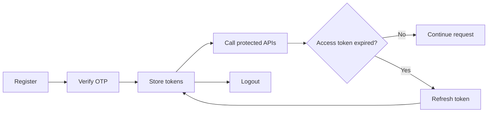
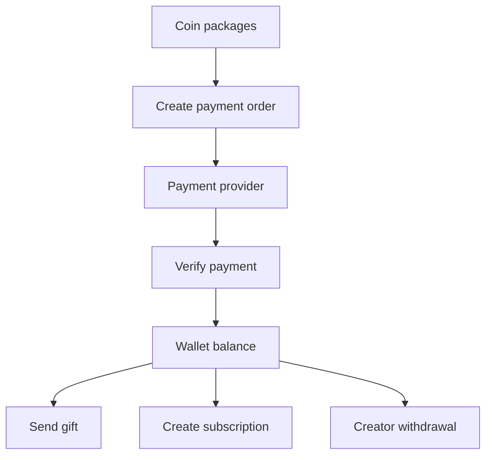

# Zemin User and Creator Guide

## Client setup

Use the API origin configured for the environment and append `/api/v1` to application requests. Send JSON with `Content-Type: application/json`; send media uploads as `multipart/form-data` to `/upload/media`.

Protected requests use:

```http
Authorization: Bearer <access-token>
```

## Account lifecycle

1. Register with `POST /auth/register`.
2. Verify the six-digit OTP with `POST /auth/verify-otp`.
3. Store the returned access and refresh tokens securely.
4. Call `GET /auth/me` to hydrate the current session.
5. When the access token expires, call `POST /auth/refresh-token` with the refresh token.
6. Call `POST /auth/logout` when ending the session.

Registration uses an alphanumeric username from 3 to 20 characters. Email registration requires `email`; phone registration requires an international phone number such as `+14155552671`. Passwords must be at least 8 characters and include uppercase, lowercase, and a number.



## Discovery and social actions

- Public discovery: `/feed/for-you`, `/search/`, `/creator/:username`, and `/live/active`.
- Personalized discovery: `/feed/following` requires authentication.
- Creator relationships: `/creator/follow`, `/creator/unfollow`, and `/creator/apply`.
- Posts: creators use `/feed/create`; users can read, comment, like, unlike, and purchase PPV access.

The same post handlers are available under both `/feed` and `/post`.

## Monetization

1. Load coin packages with `GET /wallet/packages`.
2. Create a payment order with `POST /payment/create-order`.
3. Complete payment in the provider client.
4. Verify the result with `POST /payment/verify`.
5. Use `/wallet/balance` and `/wallet/transactions` to refresh the wallet state.
6. Send gifts with `POST /gift/send` or subscribe through `/subscription/create`.

Creators can create subscription tiers and request withdrawals. Withdrawal requires creator access (`role=creator` or `isCreator=true`). Wallet handlers are also mounted under `/coin`.



## Live and chat

Create and manage rooms through `/live/create`, `/live/start`, `/live/join`, `/live/leave`, and `/live/end`. Connect Socket.IO using `handshake.auth.token` for live viewer counts, live chat, conversation rooms, and typing indicators. See [REQUEST_FLOWS.md](./REQUEST_FLOWS.md) for sequence diagrams.

## Notifications and account settings

Use `/notifications/` and `/notifications/unread-count` for the inbox, then mark individual or all notifications read. Update profile and preferences through `/user/profile` and `/user/settings`; register FCM device tokens with `/user/push-token`.

## Client error handling

Treat `401` as a session refresh or sign-in condition, `403` as a permission or ban condition, `404` as a missing resource, `409` as a conflict, `429` as retryable rate limiting, and `5xx` as a server failure. Preserve the API error `code` for user-facing handling and diagnostics.
