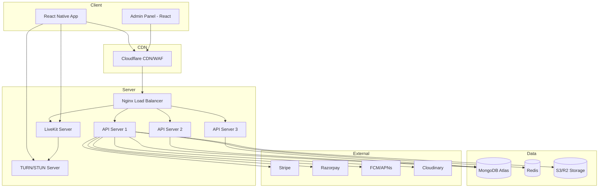
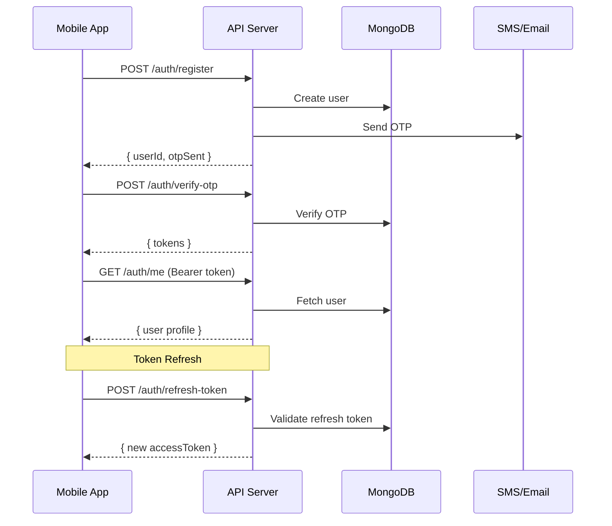
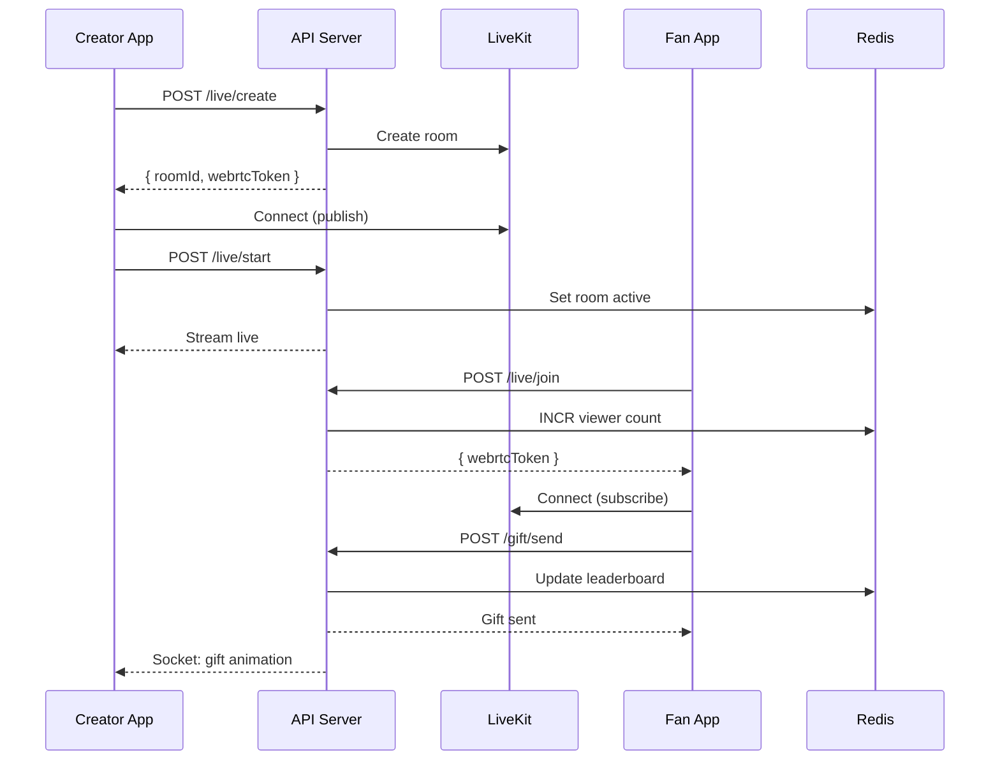
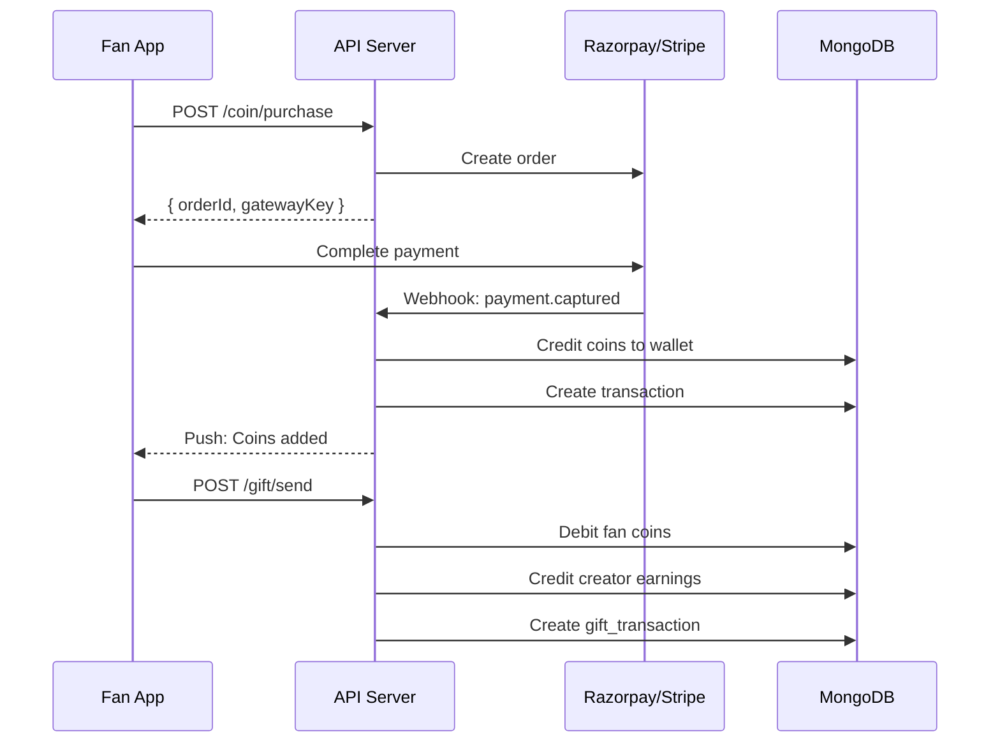
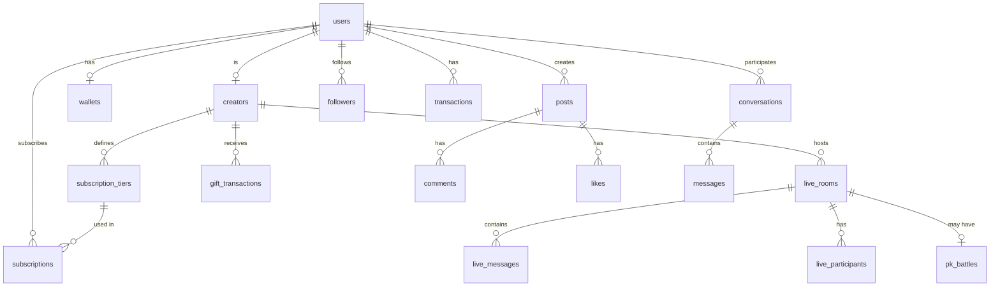
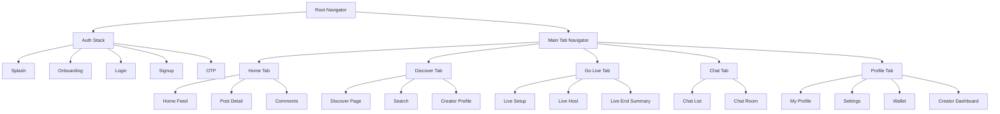
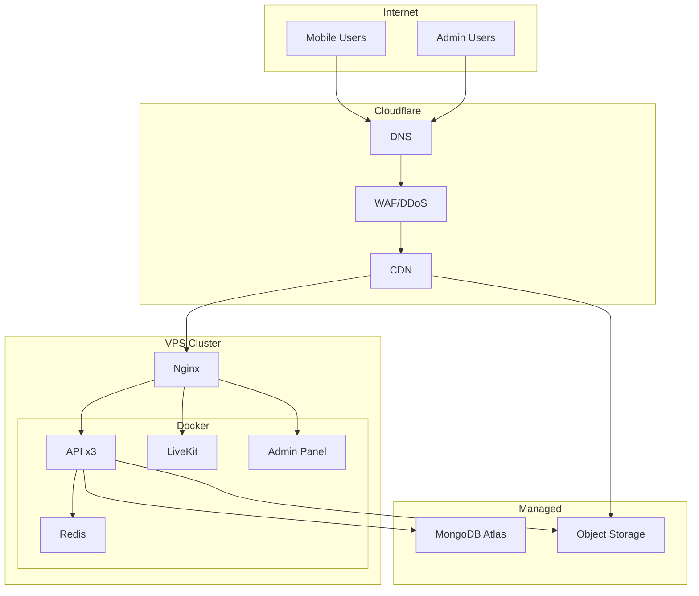
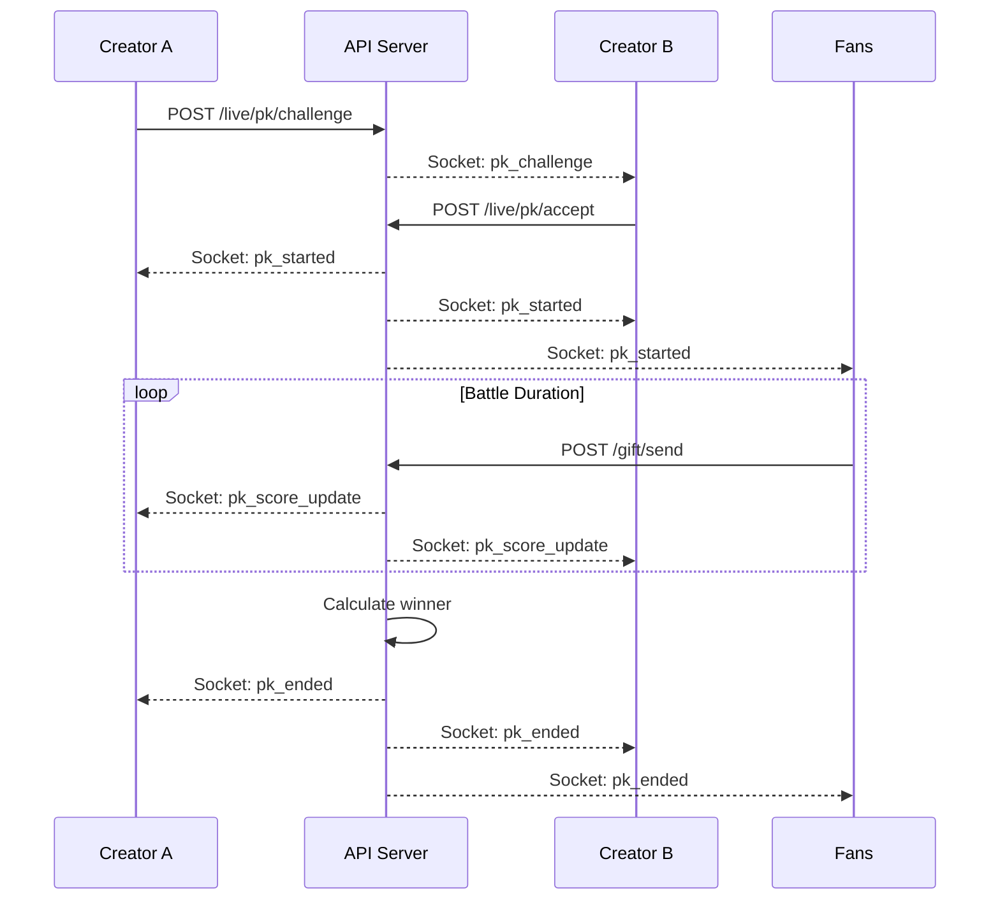

# Architecture Diagrams

## 1. System Architecture

---

## 2. Authentication Flow

---

## 3. Live Streaming Flow

---

## 4. Payment Flow

---

## 5. Database ER Diagram

---

## 6. Mobile App Navigation

---

## 7. Deployment Architecture

---

## 8. PK Battle Flow

